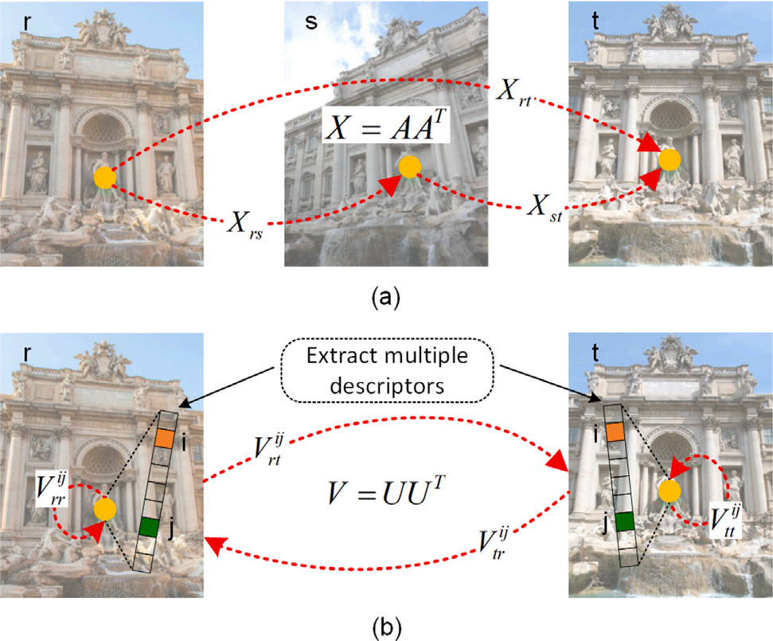
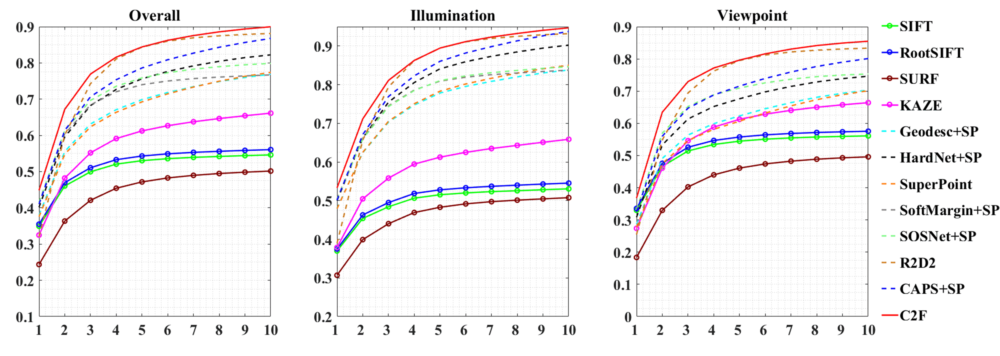
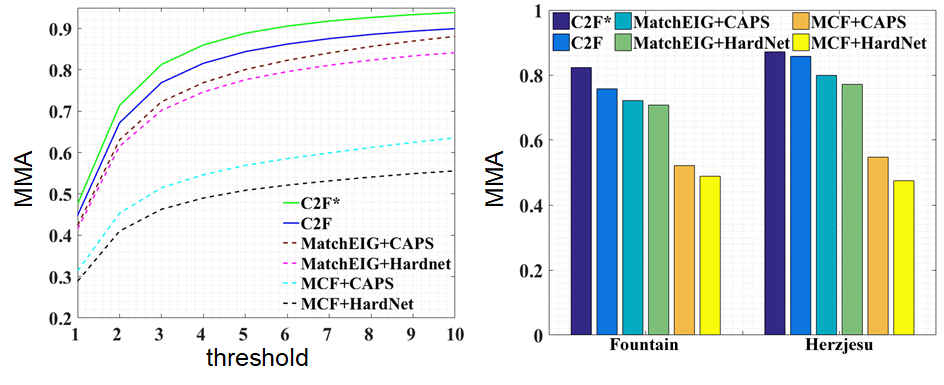
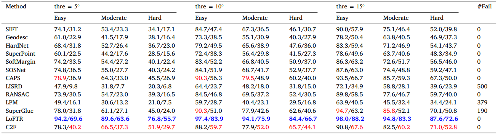

# A Unified Feature-Spatial Cycle Consistency Fusion Framework for Robust Image Matching

This repository contains a MATLAB implementation of the paper:

[*A Unified Feature-Spatial Cycle Consistency Fusion Framework for Robust Image Matching*]()
[[PDF]](https://www.sciencedirect.com/science/article/abs/pii/S1566253523001197)


[Kun Sun](http://www.cv-kunsun.cn/),
Jinhong Yu, 
[Wenbing Tao](http://faculty.hust.edu.cn/taowenbing/zh_CN/index/1485744/list/index.htm),
[Chang Tang](http://tangchang.net/),
Yuhua Qian,


## Abstract

Robust image matching is a fundamental and long-standing open problem in
computer vision. Conventional wisdom has exploited redundancy to improve
the robustness of image matching (e.g., from pairwise to multi-image correspondence), which works well in the spatial domain. Inspired by the success
of global optimization-based approaches, we propose a novel extension of cycle
consistency from multi-image to multi-descriptor matching in this paper, which
integrates useful information from the feature domain. More specifically, we
build upon previous work of permutation synchronization and construct a novel
cycle consistency model for multi-descriptor matching. The construction of cycle consistency model is based on the analogy between multi-image matching
and multi-descriptor matching in a virtual universe. It allows us to formulate
multi-image and multi-descriptor matching as a constrained global optimization
problem. We have developed a spectral relaxation algorithm to solve this optimization problem, admitting an efficient implementation via fast singular value
decomposition (SVD). To demonstrate the robustness of the proposed method
named Cycle Consistency Fusion (C2F), we have evaluated it in terms of both raw matching accuracy (pairwise or multi-image) and several higher level downstream tasks such as homography and camera pose estimation. Extensive experimental results have shown that our C2F outperforms state-of-the-art methods
consistently across different datasets and vision tasks.




## Results
· Mean Matching Accuracy (MMA) on HPatches.



· The MMA of multi-image matching on HPatches (left) and EPFL (right). Our method for pairwise and multi-image matching are denoted as C2F and C2F*, respectively.



· The accuracy of relative pose estimation (%) on the MegaDepth dataset for different angle thresholds (5◦, 10◦, 15◦). Each cell shows the rotation estimate accuracy/translation estimate
accuracy. The top two scores are highlighted by bold blue and red.



·  A visualization of the pairwise matching results on Megadepth. Green and red lines represent correct and wrong matches, respectively.


## Usage
run the mat files in C2F/demo.

## Cite
Please cite our work if you find it useful: 
```bibtex
@article{sun2023unified,
  title={A unified feature-spatial cycle consistency fusion framework for robust image matching},
  author={Sun, Kun and Yu, Jinhong and Tao, Wenbing and Li, Xin and Tang, Chang and Qian, Yuhua},
  journal={Information Fusion},
  volume={97},
  pages={101810},
  year={2023},
  publisher={Elsevier}
}
```
